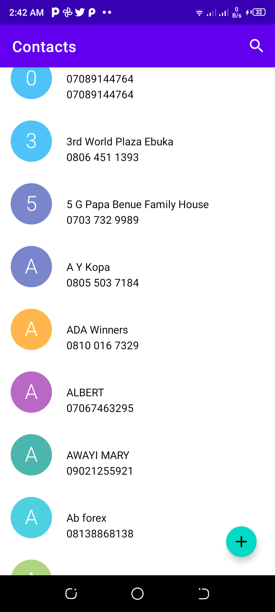
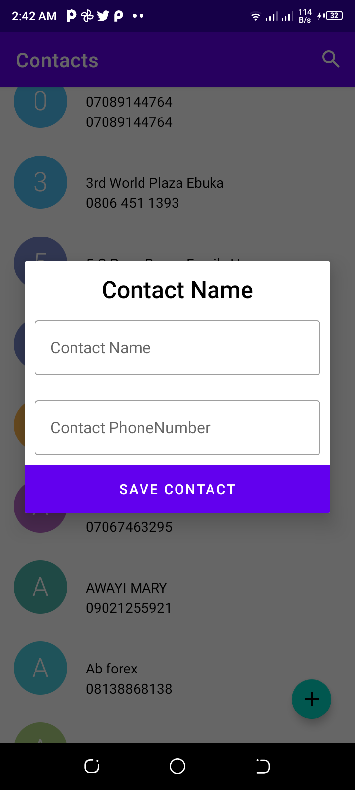
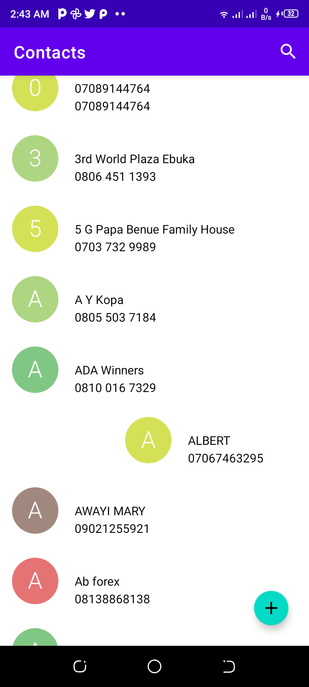
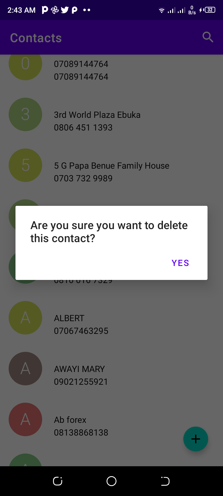
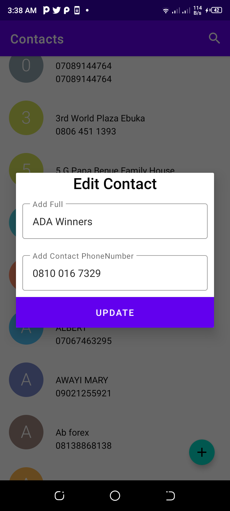
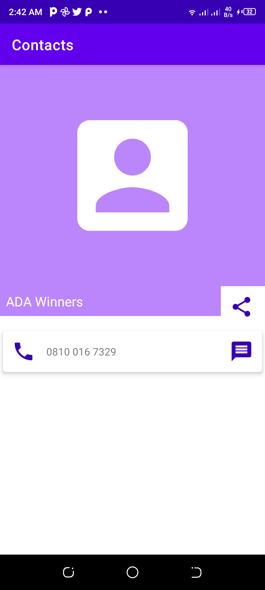

### Android Contact App

## Development
A contact application with pages to show a list of your saved contact, add contacts and a contact details page where you can edit, call, share and delete contacts. Contacts are Stored in the Cloud

Expectation: 

-   Call should ask for permission

### Implementations : 

The Contact application reads the phone contacts and displays it on a list.  

-   Ask for permission when app is launched 

-   If permission is denied display an error message in a textfield 

-   A floating action button to add contact. the contact details is saved on the cloud

-   swipe left to delete contact

-   swipe right to edit contact details

-   click on any contact to go the details page

  
  
  
  
  
  
